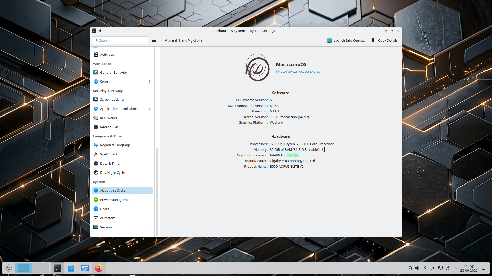
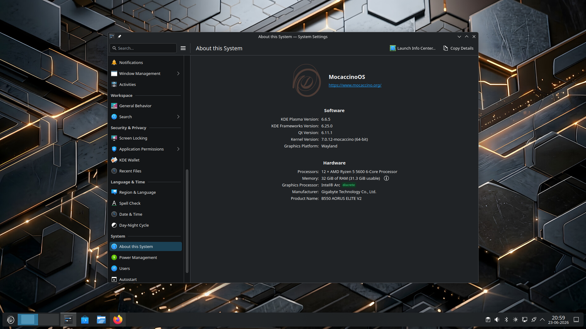

One of the highlights of the upcoming MocaccinoOS release is the addition of new Plasma desktop themes available directly out of the box.

Users can now choose between a clean light appearance and a modern dark desktop, both designed to provide a consistent experience across KDE Plasma, applications, and system components.

## Two Looks, One Experience

The new themes share the same visual identity while offering different styles depending on user preference.

### Light Theme

- Clean and bright appearance
- Excellent readability
- Ideal for well-lit environments
- Minimal and distraction-free desktop

### Dark Theme

- Modern and elegant design
- Reduced eye strain in darker environments
- Consistent dark styling throughout Plasma and KDE applications
- Optimized for extended desktop sessions

Both themes include matching window decorations, Plasma styling, and application integration to provide a polished desktop experience.

## Built on Plasma 6

The upcoming release ships with:

- KDE Plasma 6.6.5
- KDE Frameworks 6.25
- Qt 6.11
- Wayland by default
- Linux 6.18.36 kernel

Combined with MocaccinoOS optimizations and a carefully tuned Plasma setup, the result is a fast and responsive desktop environment suitable for everyday computing, development, and gaming.

## Choice Without Complexity

MocaccinoOS aims to provide sensible defaults while still giving users the freedom to personalize their desktop experience.

Whether you prefer a bright workspace during the day or a darker environment in the evening, both themes are available immediately after installation.

The upcoming release continues our focus on delivering a modern, optimized Linux desktop that is fast, responsive, and ready to use out of the box.

Which one do you prefer: Light or Dark?

Stay tuned for more details about the upcoming release.