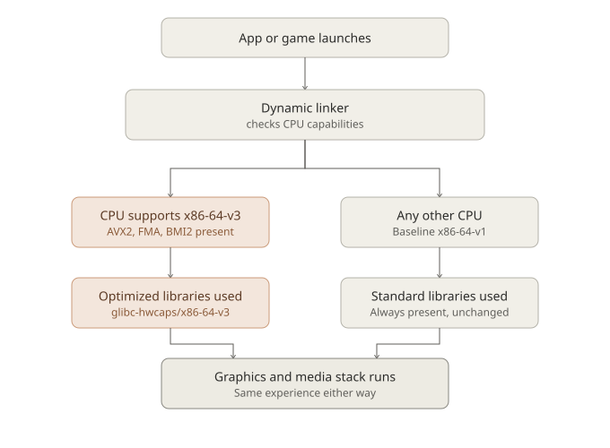

# Optional CPU-Optimized Graphics Libraries: What We're Building, and Why We're Not Hyping It

Windows 11 has spent the last few years quietly narrowing who's allowed to run it. TPM 2.0, specific CPU generation cutoffs, Secure Boot requirements — a lot of perfectly capable machines, some barely five or six years old, have been told they're no longer welcome. That's not a philosophy we share.

MocaccinoOS's position has always been the opposite: support the hardware people actually have, for as long as it's reasonable to do so. But that doesn't mean we ignore modern hardware either — it means we try to give newer CPUs something extra *without* making that a condition of support for anyone else.

That's the idea behind a new optional layer we've been building: CPU-optimized versions of key graphics and media libraries, targeting the **x86-64-v3** microarchitecture level.

## What is x86-64-v3, actually?

x86-64 CPUs have a baseline instruction set that's stayed compatible since the early 2000s — that's what "x86-64-v1" refers to, and it's what every general-purpose Linux distribution (including the default MocaccinoOS build) targets, because it runs on literally everything.

But CPUs have gained a lot of capability since then. The x86-64 psABI defines a few standardized "levels" above that baseline:

- **v2** — SSE3/SSSE3/SSE4.1/SSE4.2, POPCNT (Nehalem/Bulldozer and newer, ~2008+)
- **v3** — AVX, AVX2, FMA, BMI1/BMI2, and more (Haswell/Excavator and newer, ~2013+)
- **v4** — AVX-512 (a much narrower slice of hardware, and — as of today — largely absent from Intel's mainstream consumer CPUs entirely)

v3 is the sweet spot: it covers essentially all mainstream gaming and desktop CPUs from the last decade, both Intel and AMD, without excluding a meaningful chunk of real hardware the way v4 currently would.

## What we built

We rebuild a specific set of graphics and media libraries — currently **Mesa, Vulkan-loader, libepoxy, libglvnd, GLEW, FFmpeg, and OpenAL**, with more planned — at the x86-64-v3 level, and install the resulting shared libraries into a special directory: `/usr/lib64/glibc-hwcaps/x86-64-v3/`.

This isn't a MocaccinoOS invention — it's a mechanism glibc itself has supported since 2.33. The dynamic linker checks, at every process launch, whether the running CPU supports v3. If it does, it transparently prefers the optimized version of any library it finds there. If it doesn't, it falls straight through to the normal library your system already has — the same one every other MocaccinoOS install uses.

That fallback is the whole point. There's no detection script to write, no config file to maintain, no risk of breaking anything for CPUs that don't qualify. Older and newer hardware use the exact same package tree; only the dynamic linker's own runtime decision differs.



## How to get it, for now

This isn't shipped by default, and isn't (yet) part of the graphical installer. Right now, it's an opt-in layer you install manually if you want it and your CPU supports it. We may add it as a selectable option in Calamares down the line, but we'd rather ship something solid and tested manually first than rush a default that isn't proven yet.

To install run this command: ``` $ sudo luet install layers/X-v3```

## What kind of gain should you actually expect?

Here's where we want to be direct, because this is a space with a lot of inflated claims. Some distributions that ship similar CPU-level-optimized package sets have marketed them with numbers like "10%+ performance improvement" as a blanket statement. Independent, package-by-package testing of that exact claim tells a messier story: some packages genuinely benefit, some show no measurable difference, and a few even *regress* — because pushing more work through wider vector units can draw more power and, in some cases, run for not meaningfully less time.

For the specific packages we're targeting, the honest expectation is:

- **Mesa, Vulkan-loader, libepoxy, libglvnd, GLEW** are mostly dispatch and glue code between your game and your GPU driver. The GPU does the actual rendering work, so in GPU-bound scenarios — which is most gaming at higher resolutions — this optimization has very little room to matter.
- Where it *can* matter a little more: CPU-bound rendering scenarios — very high refresh-rate competitive titles, draw-call-heavy games, or a weaker CPU paired with a strong GPU — where driver dispatch overhead sits closer to the actual bottleneck.
- **FFmpeg** already ships hand-written, runtime-CPU-detected SIMD assembly for its codecs (libx264, libx265, dav1d, and friends). That means the biggest codec speed gains people associate with AVX2 are already happening on the standard build too, via that runtime detection — not something this rebuild newly unlocks.

We looked for real-world isolated testing of this exact kind of optimization before writing this post. The clearest example we found: a user directly comparing an x86-64-v3-optimized Proton build against a standard one, on capable AMD hardware, measured **zero additional frames per second**.[^1] Broader differences some people report between distributions doing this kind of optimization tend to trace back to kernel version and CPU scheduler choice — not the ISA-level rebuild itself.

So: expect something small, workload-dependent, and possibly unnoticeable in everyday play. Don't expect a transformation.

## Then why build it at all?

Because it's free. Once the fallback mechanism is in place, there's no cost or risk to anyone who doesn't install it, and a genuine, if modest, edge for anyone who does and has hardware that qualifies. It's also, as far as we're aware, something not many Gentoo-based distributions offer at all — a real technical differentiator, independent of exactly how many percentage points it's worth on any given benchmark.

We'd rather build something honestly small and real than market something dramatic and unproven. If you install it and it makes no difference for your workload, that's a legitimate, expected outcome — not a bug.

---

## Further technical reading

- [Fedora: Optimized Binaries for the AMD64 Architecture](https://fedoraproject.org/wiki/Changes/Optimized_Binaries_for_the_AMD64_Architecture_v2) — how another distribution approached the same psABI levels and glibc-hwcaps mechanism
- [Red Hat Developer: Building RHEL for the x86-64-v2 microarchitecture level](https://developers.redhat.com/blog/2021/01/05/building-red-hat-enterprise-linux-9-for-the-x86-64-v2-microarchitecture-level) — background on why distributions historically targeted the oldest common baseline, and what changed
- [Debian Wiki: InstructionSelection](https://wiki.debian.org/InstructionSelection) — a concise reference for the psABI microarchitecture levels and how packages are expected to use them
- [GNU Guix: Building packages targeting psABIs](https://guix.gnu.org/en/blog/2024/building-packages-targeting-psabis/) — a worked example of building and packaging glibc-hwcaps variants, including real size/tradeoff numbers
- [glibc-alpha mailing list: original proposal for x86-64 microarchitecture levels](https://sourceware.org/pipermail/libc-alpha/2020-July/116135.html) — the original technical discussion that led to this mechanism existing at all

[^1]: [Linux Mint Forums: "Low FPS compared to CachyOS"](https://forums.linuxmint.com/viewtopic.php?t=457800)